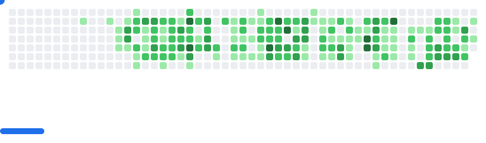

# 🚀 Hello there, I'm Binh (aka xuubinf) ✨

## 👾 About Me (Unserious person, serious codebase)

Hey there! 👋 I'm **Binh**, mostly known as **xuubinf** on the internet. I'm the guy who builds the backend so the app doesn't go 💥 when more than two people log in at the same time.  

- 💻 **Main Class**: **Backend Developer**. I spend my days crafting robust algorithms and scalable architectures primarily with **C#**, **NestJS**, and **Python FastAPI**.
- 🤖 **Current Quest**: Leveling up as an **AI Engineer (AI Application)**. I build brains for projects using **Python**, **LangChain**, and **LangGraph** to find the absolute best integration solutions for AI systems.
- 🎯 **Vibe**: 50% "Let's architect scalable microservices", 50% "Why is my prompt not returning what I want?" 😭

I take my code seriously, but I try not to take myself *too* seriously. Always down to explore new tech, debug mysterious legacy code, or chat about the latest AI breakthroughs. Let's build something cool together! ✨

  

## 🛠️ Hard Skills & Tech Arsenal

  

## 📈 GitHub Metrics

  
  

  

 

  <a href="https://next.ossinsight.io/widgets/official/compose-activity-trends?repo_id=41986369" target="_blank" style="display: block">
    <picture>
      <source media="(prefers-color-scheme: dark)" srcset="https://next.ossinsight.io/widgets/official/compose-activity-trends/thumbnail.png?repo_id=41986369&image_size=auto&color_scheme=dark" width="815" height="auto">
      
    </picture>
  </a>

  

## 🎮 Play a Game with Me

*Still holding onto that high score? Give it a try!* 🕹️

  <picture>
    <source media="(prefers-color-scheme: dark)" srcset="images/breakout-dark.svg" />
    <source media="(prefers-color-scheme: light)" srcset="images/breakout-light.svg" />
    
  </picture>

  

## 🤝 Let's Collaborate! (What I can build for you)

I'm always open to discussing new projects, creative ideas, or opportunities to be part of your visions. **Reach out to me if you need help with:**

- ⚙️ **Backend Engineering & System Design**: Building **Clean Backend** architectures, robust **APIs**, and modern **Web Applications**. I transform chaotic requirements into structured, high-performance software.
- 🧠 **Advanced AI Workflows & LLM Orchestration**: Architecting intelligent **AI Applications**, fully autonomous **AI Agents**, and complex **LLM Applications**. I specialize in finding the absolute best integration solutions for AI systems.
- 🏗️ **Modern Software Architectures**: Designing **Distributed Systems** and enterprise-grade frameworks that can gracefully handle complex business logic and massive scale.
- 💡 **Software Engineering Excellence**: Consulting on **System Design**, core **Software Engineering** practices, and optimizing existing infrastructures to be reliable and future-proof.

  

## 📫 Let's Connect!

  
  
  
  

 

  

