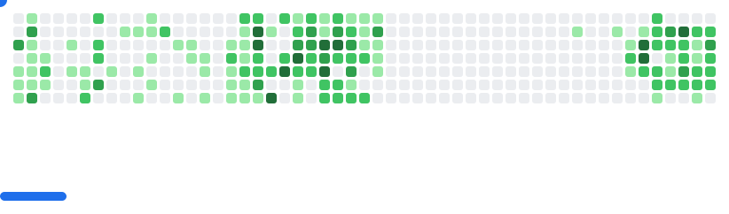

<h1 align="center"> Coucou, je suis Xuubinf ! 🫡🤭 </h1>

  

<!--
**thangbinhbeo/thangbinhbeo** is a ✨ _special_ ✨ repository because its `README.md` (this file) appears on your GitHub profile.

Here are some ideas to get you started:

- 🔭 I’m currently working on ...
- 🌱 I’m currently learning ...
- 👯 I’m looking to collaborate on ...
- 🤔 I’m looking for help with ...
- 💬 Ask me about ...
- 📫 How to reach me: ...
- 😄 Pronouns: ...
- ⚡ Fun fact: ...
-->
### Some Stats ⭐

### Play with me 🪄

  <picture>
    <source media="(prefers-color-scheme: dark)" srcset="images/breakout-dark.svg" />
    <source media="(prefers-color-scheme: light)" srcset="images/breakout-light.svg" />
    
  </picture>

### Contact me via 🫂

  
  
  <a href="https://linkedin.com/in/thangbinhbeo" target="_blank" rel="noopener noreferrer">
    

